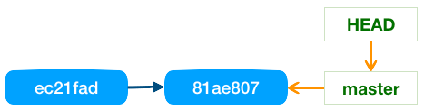

# Poruszanie się po historii Gita

## Historia w Git

Git przechowuje niezależnie wszystkie rewizje (commits) oraz wskaźniki do danej rewizji.

Rewizje są zapamiętywane w następujący sposób:


Historia rewizji zapisana zostaje w następujący sposób:


Każda rewizja pamięta swojego rodzica, czyli wersję wcześniejszą.

> Źródło: https://git-scm.com/book/pl/v2/Gałęzie-Gita-Czym-jest-gałąź

## Wskaźniki do rewizji

Git ma kilka rodzajów wskaźników do rewizji.

* ```HEAD``` - aktualnie używana rewizja
* **Znacznik (tag)** - nazwany wskaźnik ustawiany na wybraną rewizję, służy do zapamiętania historycznej wersji repozytorium
* **Gałąź (branch)** - pozwala na dodawanie nowych wersji, przesuwa się razem ze zmianami. Możliwe jest scalanie gałęzi
* **master** - domyślnie zakładana gałąź (główna), zachowuje się analogicznie jak każda inna gałąź


Git podobnie jak każdy system wersjonowania plików pozwala rozgałęziać historię. Realizowane jest to dzięki wykorzystaniu wskaźników:


## Przesuwanie przy zatwierdzaniu zmian

Najczęściej wskaźniki ```HEAD``` oraz wskaźnik bieżącej gałęzi są przesuwane przez polecenie **```git commit```**.



Po dodaniu nowej rewizji, czyli po wykonaniu operacji ```git commit```:


## Przesuwanie HEAD

Do przesuwania wskaźnika HEAD służy operacja ```git checkout```. Wskaźnik ten można przesunąć w dowolne miejsce w historii rewizji. Nawet na pozornie usunięte rewizje. Pozycję docelową można wskazać na kilka sposobów:

* podając identyfikator rewizji (nr SHA1 lub jego skróconą wersję, czyli pierwsze 7 znaków)
* podając nazwę gałęzi lokalnej
* podając nazwę gałęzi zdalnej (o ile informacje o tej gałęzi zostały pobrane ze zdalnego serwera)
* podając nazwę znacznika (tag)
* odwołując się względem aktualniej głowy (np. dwie rewizje wcześniej)
* odwołując się względem dowolnej pozycji

Przesuwając głowę HEAD zmianie ulega również katalog roboczy, czyli wszystkie pliki są modyfikowane do postaci jaką miały we wskazanej rewizji, a pliki które wtedy jeszcze nie istniały zostają usunięte. Podobnie pliki usunięte z repozytorium mogą pojawić się w katalogu roboczym w momencie przesuwania się po historii przy pomocy polecenia ```git checkout```.

Polecenie ```git checkout``` wymaga, aby poczekalnia (Staging area / Index) była pusta. Jeżeli jest pełna to dostaniemy ostrzeżenie, a jeżeli mimo wszystko wykonamy polecenie na siłę ```git checkout --force``` to poczekalnia zostanie wyczyszczona i zapisane tam zmiany zostaną utracone (bezpowrotnie).

Przykłady:

```
git checkout deed4fd
git checkout poprawka-bledu-123
git checkout upstream/master
git checkout v0.3.13
git checkout HEAD~5
git checkout HEAD^^^
git checkout deed4fd~2
```

## Detached HEAD

>**TODO:** Przetłumaczyć i opisać

> This is called a detached HEAD. Example commands that will cause your HEAD to become detached (ouch!) are[1]:
```
git checkout master^        # parent of master
git checkout HEAD~2         # grandparent of current HEAD
git checkout origin/master  # a non-local branch
git checkout tagname        # since you cant commit to a tag!
```
