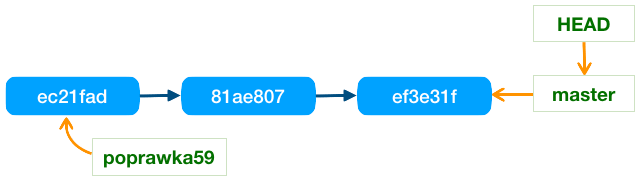
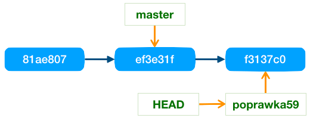

# Praca z gałęziami

Tematy opisane w ramach artykułu:
- Zarządzanie gałęziami
- Przełączanie między gałęziami
- Rozgałęzianie historii
- Gałęzie zdalne **[[[w toku]]]**
- Porządkowanie gałęzi lokalnych **[[[w toku]]]**
- Porządkowanie gałęzi zdalnych **[[[w toku]]]**

## Zarządzanie gałęziami

Do operacji pozwalających na zarządzanie gałęziami można zaliczyć:

1. Tworzenie gałęzi
2. Usuwanie gałęzi
3. Przesuwanie gałęzi

Do tworzenia oraz do zarządzania gałęziami służy głównie polecenie ```git branch```, aby dodać nową gałąź należy do tego polecenia dodać nazwę gałęzi, która musi być unikalna w ramach całego repozytorium. Przykładowe polecenie tworzące nową gałąź:

```
git branch poprawka59
```

Podobnie usunięcie gałęzi jest wykonuje się tym samym poleceniem dodając opcję ```-d``` lub ```--delete```, tak jak na poniższym przykładzie:

```
git branch -d poprawka59
```

Nie można w ten sposób usuwać gałęzi, które nie zostały scalona z resztą drzewa, czyli gdy ta gałąź nie zawiera się w historii innej gałęzi. Blokada ta wynika z faktu, że rewizje podczepione do takiej gałęzi mogą zniknąć z historii repozytorium po usunięciu jedynego wskaźnika do nich. Więcej informacji na  temat wskaźników do rewizji można znaleźć w artykule [Poruszanie się po historii](./MovingAroundHistory.md).

Jeśli mimo powyższej blokady chcemy wykonać tą operację, czyli usunąć gałąź która nie została scalona z resztą drzewa to taką operację musimy wymusić opcją ```--force``` lub ```-f```, w skrócie można napisać ```-df``` lub jeszcze krócej ```-D```:

```
git branch -D poprawka59
```

W strukturach repozytorium gałąź jest obiektem, który wskazuję na aktualną rewizję, z kolei ta rewizja wskazuje na wcześniejszą rewizję (wersję) itd. Czyli struktura przykładowego repozytorium z jedną gałęzią ```master``` mogłaby wyglądać w ten sposób:


Wskaźnik ```HEAD``` to bieżące miejsce, czyli miejsce w które są wstawiane nowe zmiany ```git commit``` oraz gdzie wykonywane są inne bieżące informacje, takie jak ```diff``` i wiele innych.

Usuwając gałąź do repozytorium lub dodając ją robimy tylko prostą operacje usunięcia lub dodania nowego obiektu wskazującego pewną wersję. Bardzo ważne, że do jej ukończenia nigdy nie trzeba przebudowywać aktualnej struktury repozytorium.

Równie łatwo jak dodawać/usuwać można także przesuwać gałąź na aktualną rewizję (```HEAD```). Spójrzmy na przykład:



Gałąź ```poprawka59``` ustawioną jest na wcześniejszej rewizji, jeśli chcemy ją przestawić na aktualne miejsce to możemy usunąć gałąź i od razu ją dodać:

```
git branch -d poprawka59
git branch poprawka59
```

Dla uproszczenia operacji można zignorować wszystkie ostrzeżenia i dodać już istniejącą gałąź z opcją ```-f``` lub ```--force```:

```
git branch -f poprawka59
```

W wyniku wywołanych poleceń przesuniemy gałąź na bieżącą wersję w historii rewizji:


## Przełączanie między gałęziami

Przełączenie między gałęziami wykonuje polecenie ```git checkout```. Gałąź na którą chcemy się przełączyć podajemy jako parametr:

```
git checkout poprawka59
```

Po wykonaniu tej operacji, głowa ```HEAD``` zostanie przestawiona na gałąź ```poprawka59```, czyli bieżące operacje będą wykonywane w tym miejscu: 


Po zatwierdzeniu zmian zostanie utworzona nowa rewizja, a wskaźnik gałęzi przesunięty na nią:



Kolejne przełączenie się na gałąź ```master```, spowoduje, że w plikach roboczych znikną wprowadzone wcześniej zmiany. Wywołujemy:
 
```
git checkout master
```

Głowa zostaje przełączona na gałąź ```master```, a pliki znajdujące się katalogu roboczym zostana zmodyfikowane tak, aby wyglądały tak jak wcześniej, czyli przed wprowadzoną zmianą. Jednak zmiany nie znikają na stałe, ponieważ są już utrwalone w repozytorium i każdej chwili można się na nie przełączyć wywołując polecenie ```git checkout poprawka59```

Polecenie ```git checkout``` pozwala przełączyć ```HEAD``` na dowolną rewizję w repozytorium (nie tylko na którąś z gałęzi). W tym celu musimy znać identyfikator wersji lub jego skróconą wersję (7 znaków). Patrząc na przykłady podane wcześniej widać, że jedna z wcześniejszych rewizji identyfikowana jest skrótem: ```81ae807```. Przełączając się w takie miejsce powinniśmy równocześnie utworzyć nową gałąź w tym miejscu, aby nie otrzymać tzw. odczepionej głowy. Do utworznia nowej gałęzi służy opcja ```-b```:

```
git checkout b8f9e20 -b eksperymencik
```

Więcej informacji o poruszaniu się po historii repozytorium oraz odczepionej głowie można znaleźć w artykule: [Poruszanie się po historii](./MovingAroundHistory.md).

Jeśli gałąź może już istnieć to trzeba ją przestawić na bieżące czyli zresetować. Można to zrobić przy pomocy opcji ```-B```. Tak jak w przykładzie:

```
git checkout -B patchBP
```

Co jest równoważne poleceniom:

```
git branch -f patchBP
git checkout patchBP
```

## Rozgałęzianie historii

Gałąź w Git to lekki obiekt (ma niewielki rozmiar), który wskazuje na najnowszą zmianę (rewizję). Wprowadzając zmianę raz w jednej gałęzi, a następnie w drugiej możemy rozgałęzić historię rewizji naszego repozytorium.

Git podobnie jak każdy system wersjonowania plików pozwala rozgałęziać historię, jednak w tym przypadku jest to wyjątkowo lekka i bardzo bezpieczna operacja. Polega na stworzeniu w strukturach repozytorium nowego obiektu, który wskazuję aktualną rewizję. Obiekt ten nazywamy gałęzią (branch). Gałąź nie tworzy kopii swojej własnej historii, ale jedynie wskazuje miejsce w drzewie rewizji, czyli w historii repozytorium.


## Gałęzie zdalne

## Porządkowanie gałęzi lokalnych (usuwanie zbędnych)

Lista gałęzi scalonych z gałęzią główną (master) 
```
git branch --merged master 
```
Lista gałęzi scalonych z HEAD, czyli z głową bieżącej gałęzi
```
git branch --merged 
```

Lista gałęzi **niescalonych** z HEAD (j.w.)
```
git branch --no-merged
```

## Porządkowanie gałęzi zdalnych

Aktualizacja zapamiętanej lokalnie listy zdalnych gałęzi w śledzonych zdalnych repozytoriach (```prune cache```)

```
git fetch -p origin
git fetch --prune origin
```

Angielski opis z dokumentacji ```fetch --prune```

> ```Before fetching, remove any remote-tracking references that no longer exist on the remote. Tags are not subject to pruning if they are fetched only because of the default tag auto-following or due to a --tags option. However, if tags are fetched due to an explicit refspec (either on the command line or in the remote configuration, for example if the remote was cloned with the --mirror option), then they are also subject to pruning```

Lista gałęzi lokalnych i zdalnych
```
git branch --all
git branch -a
git branch --remote
git branch -r
```

Kasowanie gałęzi zdalnej

```
git push origin :pg-branches-v1
git push origin --delete pg-branches-v1
```
