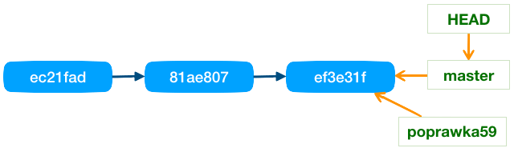

# Praca z gałęziami

## Tworzenie gałęzi

Do tworzenia oraz do zarządzania gałęziami służy głównie polecenie ```git branch```. Dodanie nowej gałęzi można zlecić dodając nazwę gałęzi. Nazwa gałęzi musi być unikalna i nie może być powtórzona.

```
git branch poprawka59
```

Podobnie usunięcie gałęzi jest wykonuje się tym samym poleceniem dodając opcję ```-d``` lub ```--delete```.

```
git branch -d poprawka59
```

Usuwać w ten sposób nie można gałęzi, które nie zostały scalona z resztą drzewa. Blokada ta wynika z faktu, że taka gałąź może zniknąć z loga (historii zmian) jeśli usuniemy wskaźnik do niej (w tym wypadku takim wskaźnikiem jest gałąź). W artykule [Poruszanie się po historii](./MovingAroundHistory.md) opisuję, dlaczego tak się dzieje.

Jeśli mimo powyższej blokady chcemy usunąć gałąź, która nie została scalona to taką operację musimy wymusić opcją ```--force``` lub ```-f```, w skrócie zamiast pisać ```-df``` możemy napisać ```-D```:

```
git branch -D poprawka59
```

W strukturach repozytorium gałąź jest obiektem, który wskazuję na aktualną rewizję, z kolei ta rewizja wskazuje na wcześniejszą rewizję (wersję) itd. Czyli struktura przykładowego repozytorium z jedną gałęzią ```master``` mogłaby wyglądać w ten sposób:


Usuwając lub dodając gałąź do repozytorium robimy tylko prostą operacje usunięcia lub dodania nowego obiektu wskazującego na bieżące miejsce, czyli ```HEAD```. Nie zaburzamy, ani nie przebudowujemy aktualnej struktury repozytorium.

Równie łatwo można przesuwać wskaźnik gałęzi w aktualne miejsce. Spójrzmy na przykład:


Gałąź ```poprawka59``` ustawioną jest na wcześniejszej rewizji, jeśli chcemy ją przestawić na aktualne miejsce to możemy usunąć gałąź i od razu ją dodać lub też wystarczy tylko dodać gałęź ```poprawka59``` z opcją ```-f``` lub ```--force```

```
git branch -f poprawka59
```

W wyniku otrzymamy następującą sytuację:



# Przełączanie między gałęziami

Przełączenie między gałęziami wykonuje polecenie ```git checkout``` jak trzeci parametr podajemy nazwę gałęzi.

```
git checkout poprawka59
# ... jesteśmy w gałęzi poprawka59
#     możemy wykonać jakieś poprawki
#     następnie zatwierdzić zmiany tworząc nową rewizję
git checkout master
# ... wracamy z powrotem do gałęzi master
#     zmiany wprowadzone wcześniej znikają
```

Polecenie ```git checkout``` pozwala natychmiast po przełączeniu utworzyć w tym miejscu nową gałąź (a dokładniej to utworzyć wskaźnik do nowej gałęzi). W tym celu wykorzystujemy opcję ```-b```. Takie zastosowanie ma sens szczególnie wtedy gdy przełączamy się na któraś z wybranych wcześniejszych wersji (podając jej identyfikator)

```
git checkout b8f9e20 -b eksperymencik
```

Jeśli gałąź może już istnieć to trzeba ją wyczyścić i przestawić na bieżące miejsce, Można to zrobić przy pomocy operacji

```
git checkout -B patchBP
```

Co jest równoważne poleceniom:

```
git branch -f patchBP
git checkout patchBP
```

## Rozgałęzianie historii

Gałąź w Git to lekki obiekt (ma niewielki rozmiar), który wskazuje na najnowszą zmianę (rewizję). Wprowadzając zmianę raz w jednej gałęzi, a następnie w drugiej możemy rozgałęzić historię rewizji naszego repozytorium.

Git podobnie jak każdy system wersjonowania plików pozwala rozgałęziać historię, jednak w tym przypadku jest to wyjątkowo lekka i bardzo bezpieczna operacja. Polega na stworzeniu w strukturach repozytorium nowego obiektu, który wskazuję aktualną rewizję. Obiekt ten nazywamy gałęzią (branch). Gałąź nie tworzy kopii swojej własnej historii, ale jedynie wskazuje miejsce w drzewie rewizji, czyli w historii repozytorium.


## Gałęzie lokalne i zdalne

## Porządkowanie gałęzi lokalnych (usuwanie zbędnych)

Lista gałęzi scalonych z gałęzią główną (master) 
```
git branch --merged master 
```
Lista gałęzi scalonych z HEAD, czyli z głową bieżącej gałęzi
```
git branch --merged 
```

Lista gałęzi **niescalonych** z HEAD (j.w.)
```
git branch --no-merged
```

## Porządkowanie gałęzi zdalnych

Aktualizacja zapamiętanej lokalnie listy zdalnych gałęzi w śledzonych zdalnych repozytoriach (```prune cache```)

```
git fetch -p origin
git fetch --prune origin
```

Angielski opis z dokumentacji ```fetch --prune```

> ```Before fetching, remove any remote-tracking references that no longer exist on the remote. Tags are not subject to pruning if they are fetched only because of the default tag auto-following or due to a --tags option. However, if tags are fetched due to an explicit refspec (either on the command line or in the remote configuration, for example if the remote was cloned with the --mirror option), then they are also subject to pruning```

Lista gałęzi lokalnych i zdalnych
```
git branch --all
git branch -a
git branch --remote
git branch -r
```

Kasowanie gałęzi zdalnej

```
git push origin :pg-branches-v1
git push origin --delete pg-branches-v1
```
